<div style="position: absolute; top: 0; right: 0;">
    <a href="ertugrulbusiness@gmail.com"></a>
    <a href="https://tr.linkedin.com/in/ertu%C4%9Fruldemir?original_referer=https%3A%2F%2Fwww.google.com%2F"></a>
    <a href="https://github.com/ertugruldmr"></a>
    <a href="https://www.kaggle.com/erturuldemir"></a>
    <a href="https://huggingface.co/ErtugrulDemir"></a>
    <a href="https://stackoverflow.com/users/21569249/ertu%c4%9frul-demir?tab=profile"></a>
    <a href="https://medium.com/@ertugrulbusiness"></a>
    <a href="https://www.youtube.com/channel/UCB0_UTu-zbIsoRBHgpsrlsA"></a>
</div>

# Customer Clustering 
 
## __Table Of Content__
- (A) [__Brief__](#brief)
  - [__Project__](#project)
  - [__Data__](#data)
  - [__Demo__](#demo) -> [Live Demo](https://ertugruldemir-customerclustering.hf.space)
  - [__Study__](#problemgoal-and-solving-approach) -> [Colab]()
  - [__Results__](#results)
- (B) [__Detailed__](#Details)
  - [__Abstract__](#abstract)
  - [__Explanation of the study__](#explanation-of-the-study)
    - [__(A) Dependencies__](#a-dependencies)
    - [__(B) Dataset__](#b-dataset)
    - [__(C) Pre-processing__](#c-pre-processing)
    - [__(D) Exploratory Data Analysis__](#d-exploratory-data-analysis)
    - [__(E) Modelling__](#e-modelling)
    - [__(F) Saving the project__](#f-saving-the-project)
    - [__(G) Deployment as web demo app__](#g-deployment-as-web-demo-app)
  - [__Licance__](#license)
  - [__Connection Links__](#connection-links)

## __Brief__ 

### __Project__ 
- This is a __clustering__ project that uses the  [__Mall Customers Dataset__](https://www.kaggle.com/datasets/shwetabh123/mall-customers?select=Mall_Customers.csv) to __cluster the customers__.
- The __goal__ is build a model that accurately __cluster the customers__  based on the features. 
- The performance of the model is evaluated using several  __metrics__, including Distortion Score Elbow, dendogram, silhouette_score, distance metrics etc....

#### __Overview__
- This project involves building a machine learning model to clustering the students based on their features. The dataset contains 200 records.5 attributes which 4 numerical and 1 categorical, The project uses Python and several popular libraries such as Pandas, NumPy, and Scikit-learn.
#### __Demo__

<div align="left">
  <table>
    <tr>
    <td>
        <a target="_blank" href="https://ertugruldemir-customerclustering.hf.space" height="30">[Demo app] HF Space</a>
      </td>
      <td>
        <a target="_blank" href="
">[Demo app] Run in Colab</a>
      </td>
      <td>
        <a target="_blank" href="">[Traning pipeline] source on GitHub</a>
      </td>
    <td>
        <a target="_blank" href="">[Traning pipeline] Run in Colab</a>
      </td>
    </tr>
  </table>
</div>


- Description
    - __cluster the customers__  based on features.
    - __Usage__: Set the feature values through sliding the radio buttons then use the button to predict.
- Embedded [Demo](https://ertugruldemir-customerclustering.hf.space) window from HuggingFace Space
    

<iframe
	src="https://ertugruldemir-customerclustering.hf.space"
	frameborder="0"
	width="850"
	height="450"
></iframe>

#### __Data__
- The [__Mall Customers Dataset__](https://www.kaggle.com/datasets/shwetabh123/mall-customers?select=Mall_Customers.csv) from UCI website.
- The dataset contains 5 features, 4 numerical are numerical and 1 categorical.
- The dataset contains the following features:


<table>
<tr><th>Data Info </th><th><div style="padding-left: 50px;">Stats</div></th></tr>
<tr><td>

| #   | Column                  | Non-Null Count | Dtype    |
| --- | ---------------------- | -------------- | --------|
| 0   | CustomerID              | 200 non-null   | int64   |
| 1   | Gender                  | 200 non-null   | category|
| 2   | Age                     | 200 non-null   | int64   |
| 3   | Annual Income (k$)      | 200 non-null   | int64   |
| 4   | Spending Score (1-100)  | 200 non-null   | int64   |


</td><td>


<div style="flex: 50%; padding-left: 50px;">

|                    | count |  mean  |   std   | min | 25%  | 50%  | 75%  |  max  |
| :----------------: | :---: | :----: | :-----: | :-: | :--: | :--: | :--: | :---: |
|     CustomerID     |  200  | 100.50 | 57.8792 | 1.0 | 50.75| 100.5|150.25| 200.0 |
|         Age        |  200  | 38.85  | 13.9690 |18.0 |28.75 | 36.0 | 49.0 | 70.0  |
| Annual Income (k$) |  200  | 60.56  | 26.2647 |15.0 |41.50 | 61.5 | 78.0 | 137.0 |
|Spending Score (1-100)|200 | 50.20 | 25.8235 | 1.0 |34.75 | 50.0 | 73.0 | 99.0  |

</div>

</td></tr> </table>


#### Problem, Goal and Solving approach
- This is a __clustering__ problem  that uses  [__Mall Customers Dataset__](https://www.kaggle.com/datasets/shwetabh123/mall-customers?select=Mall_Customers.csv)  from UCI to __cluster the customers__ based on 5 features which 4 numerical and 1 categorical.
- The __goal__ is to build a model that accurately __clustering the customers__ based on the features.
- __Solving approach__ is that using the unsupervised machine learning models (knn, Hierarchical Clusterings (dendogram, Agg...)).

#### Study
The project aimed predict the wine quality score classes using the features. The study includes following chapters.
- __(A) Dependencies__: Installations and imports of the libraries.
- __(B) Dataset__: Downloading and loading the dataset.
- __(C) Pre-processing__: It includes data type casting, missing value handling, outlier handling.
- __(D) Exploratory Data Analysis__: Univariate, Bivariate, Multivariate anaylsises. Correlation and other relations. 
- __(E) Modelling__: Model tuning via GridSearch and KElbowVisualizer on knn, dendogram, AgglomerativeClustering.  
- __(F) Saving the project__: Saving the project and demo studies.
- __(G) Deployment as web demo app__: Creating Gradio Web app to Demostrate the project.Then Serving the demo via huggingface as live.

#### results
- The final model is __knn cluster__ because of the results and less complexity.
- Following figures are clustered label distribution and KelBowTuning
  <div style="text-align: center;">
      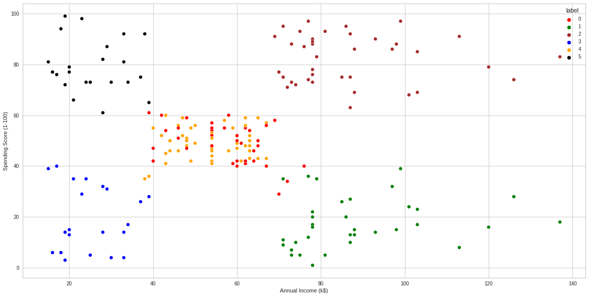
      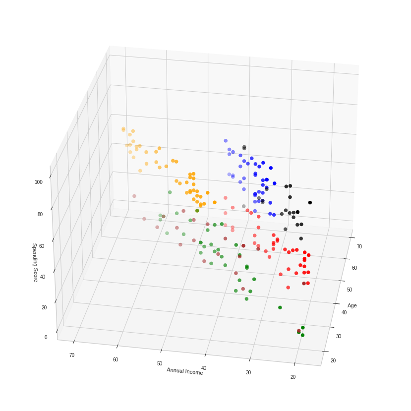
      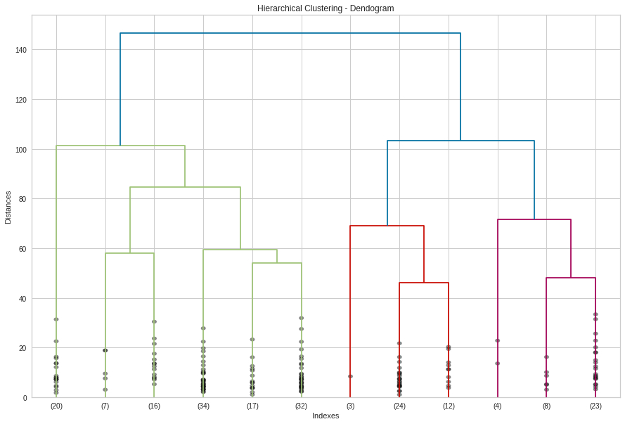
  </div>


## Details

### Abstract
- [__Mall Customers Dataset__](https://www.kaggle.com/datasets/shwetabh123/mall-customers?select=Mall_Customers.csv) is used to cluster the customers. The dataset contains 200 records.5 attributes which 4 numerical and 1 categorical. The problem is an unsupervised learning task as clustering problem. The goal is clustering the customers through using unsupervised machine learning algorithms such as knn, pca with knn, dendogramand, AgglomerativeClustering amd other similar models.The study includes creating the environment, getting the data, preprocessing the data, exploring the data, modelling the data, saving the results, deployment as demo app. Training phase of the models implemented through cross validation and Grid Search model tuning and KElbow approachs.  Models are evaluated with cross validation methods using 5 split. clustering results collected and compared between the models. Selected the basic and more succesful model. Tuned __knn cluster__ model has been selected as final model after the whole study.  Related results can be found at the results section. pca implemented for 2d and 3d visualization. Created a demo at the demo app section and served on huggingface space.  

### File Structures

- File Structure Tree
```bash
├── demo_app
│   ├── app.py
│   ├── requirements.txt
│   └── cluster.sav
├── docs
│   └── images
├── env
│   ├── env_installation.md
│   └── requirements.txt
├── LICENSE
├── readme.md
└── study.ipynb
```
- Description of the files
  - demo_app/
    - Includes the demo web app files, it has the all the requirements in the folder so it can serve on anywhere.
  - demo_app/examples.pkl
    - It includes example cases to run the demo.
  - demo_app/cluster.sav:
    - The trained (Model Tuned) model as pickle (python object saving) format.
  - demo_app/requirements.txt
    - It includes the dependencies of the demo_app.
  - docs/
    - Includes the documents about results and presentations
  - env/
    - It includes the training environmet related files. these are required when you run the study.ipynb file.
  - LICENSE.txt
    - It is the pure apache 2.0 licence. It isn't edited.
  - readme.md
    - It includes all the explanations about the project
  - study.ipynb
    - It is all the studies about solving the problem which reason of the dataset existance.    

### Explanation of the Study
#### __(A) Dependencies__:
  -  There is no third-parth installation instead of kaggle dataset api for getting the dataset. The libraries which already installed on the environment are enough. You can create an environment via env/requirements.txt. Create a virtual environment then use the following code. It is enough to satisfy the requirements for runing the study.ipynb which training pipeline.
#### __(B) Dataset__: 
  - Downloading the [__Mall Customers Dataset__](https://www.kaggle.com/datasets/shwetabh123/mall-customers?select=Mall_Customers.csv) via kaggle platform. The dataset has  200 records.5 attributes which 4 numerical and 1 categorical. For more info such as histograms and etc... you can look the '(D) Exploratory Data Analysis' chapter.
#### __(C) Pre-processing__: 
  - The processes are below:
    - Preparing the dtypes such as casting the object type to categorical type.
    - Missing value processes: there was no missing value.
    - Outlier analysis processes: uses  both visual and IQR calculation apporachs. According to IQR approach ,there was no outlier as significant..

      <div style="text-align: center;">
          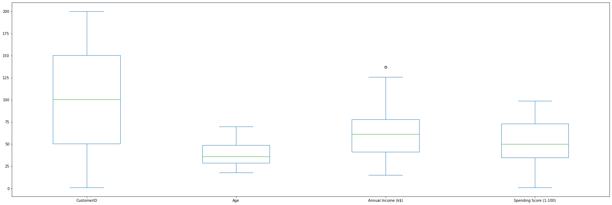
      </div>
 
#### __(D) Exploratory Data Analysis__:
  - Dataset Stats

<table>
<tr><th>Data Info </th><th><div style="padding-left: 50px;">Stats</div></th></tr>
<tr><td>

| #   | Column                  | Non-Null Count | Dtype    |
| --- | ---------------------- | -------------- | --------|
| 0   | CustomerID              | 200 non-null   | int64   |
| 1   | Gender                  | 200 non-null   | category|
| 2   | Age                     | 200 non-null   | int64   |
| 3   | Annual Income (k$)      | 200 non-null   | int64   |
| 4   | Spending Score (1-100)  | 200 non-null   | int64   |


</td><td>


<div style="flex: 50%; padding-left: 50px;">

|                    | count |  mean  |   std   | min | 25%  | 50%  | 75%  |  max  |
| :----------------: | :---: | :----: | :-----: | :-: | :--: | :--: | :--: | :---: |
|     CustomerID     |  200  | 100.50 | 57.8792 | 1.0 | 50.75| 100.5|150.25| 200.0 |
|         Age        |  200  | 38.85  | 13.9690 |18.0 |28.75 | 36.0 | 49.0 | 70.0  |
| Annual Income (k$) |  200  | 60.56  | 26.2647 |15.0 |41.50 | 61.5 | 78.0 | 137.0 |
|Spending Score (1-100)|200 | 50.20 | 25.8235 | 1.0 |34.75 | 50.0 | 73.0 | 99.0  |

</div>

</td></tr> </table>
  - Variable Analysis
    - Univariate analysis, 
      <div style="text-align: center;">
          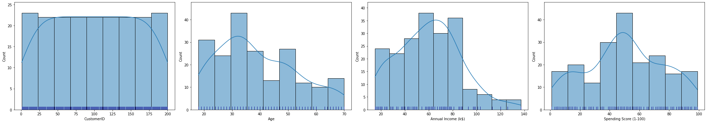
           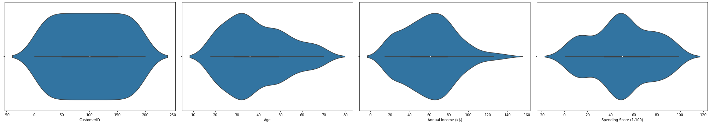
      </div>
    - Bivariate analysis
      <div style="text-align: center;">
          
          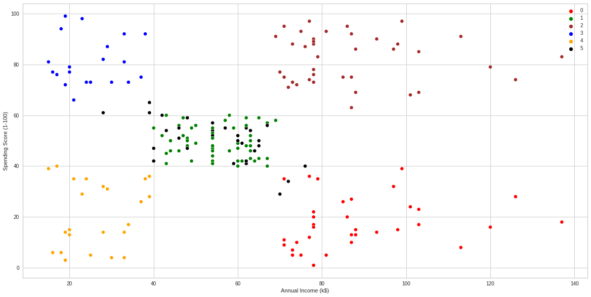
          
          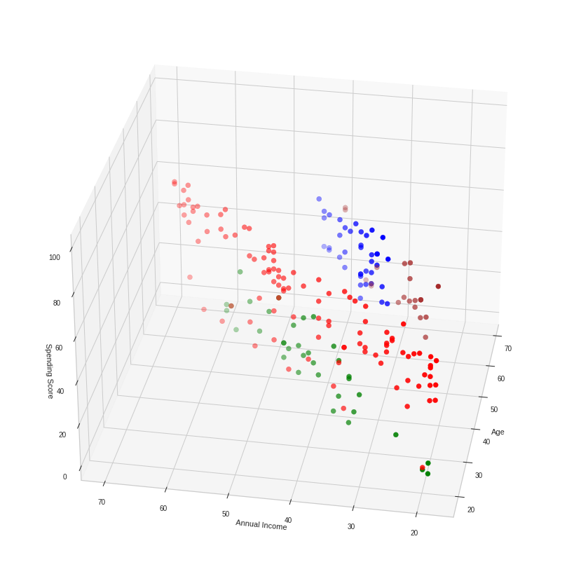
      </div>
    - Multivariate analysis.
      <div style="text-align: center;">
          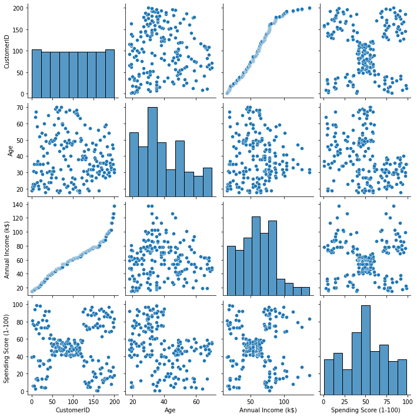
      </div>
  - Other relations.
    <div style="display:flex; justify-content: center; align-items:center;">
      <div style="text-align: center;">
      <figure>
      <p>Correlation</p>
      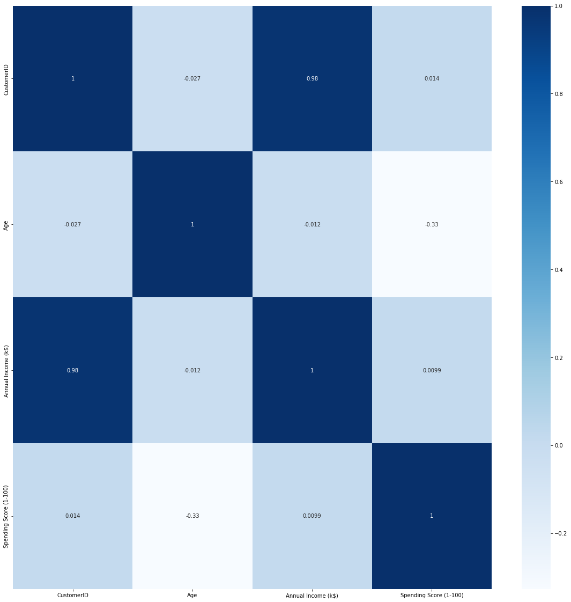
      </figure>
      </div>
      <div style="text-align: center;">
      <figure>
      <p>Variance</p>
      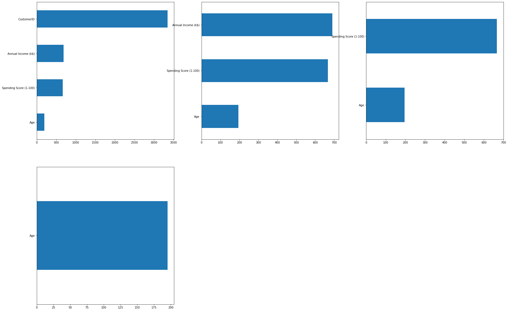
      </figure>
      </div>
    </div>

#### __(E) Modelling__: 
  - Data Split
    - Splitting the dataset via  sklearn.model_selection.train_test_split (test_size = 0.2).
  - Util Functions
    - Greedy Step Tune
      - It is a custom tuning approach created by me. It tunes just a hyperparameter per step using through GridSerchCV. It assumes the params ordered by importance so it reduces the computation and time consumption.  
    - KelBOw
      - It tunes knn then returns the Distortion results over neighbour size.

  - knn with kelbow
      <div style="display:flex; justify-content: center; align-items:center;">
          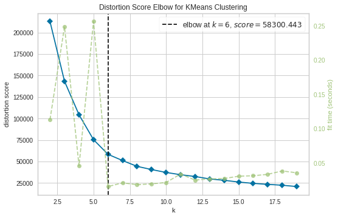
          
          
      </div>
  - AgglomerativeClustering with dendogram
      <div style="display:flex; justify-content: center; align-items:center;">
          
          
          
      </div>

#### __(F) Saving the project__: 
  - Saving the project and demo studies.
    - trained model __knn_model.sav__ as pickle format.
#### __(G) Deployment as web demo app__: 
  - Creating Gradio Web app to Demostrate the project.Then Serving the demo via huggingface as live.
  - Desciption
    - Project goal is clustering the customers based on four features.
    - Usage: Set the feature values through radio buttons then use the button to predict.
  - Demo
    - The demo app in the demo_app folder as an individual project. All the requirements and dependencies are in there. You can run it anywhere if you install the requirements.txt.
    - You can find the live demo as huggingface space in this [demo link](https://ertugruldemir-customerclustering.hf.space) as full web page or you can also us the [embedded demo widget](#demo)  in this document.  
    
## License
- This project is licensed under the Apache 2.0 License. See the [LICENSE](LICENSE) file for details.

<h1 style="text-align: center;">Connection Links</h1>

<div style="text-align: center;">
    <a href="ertugrulbusiness@gmail.com"></a>
    <a href="https://tr.linkedin.com/in/ertu%C4%9Fruldemir?original_referer=https%3A%2F%2Fwww.google.com%2F"></a>
    <a href="https://github.com/ertugruldmr"></a>
    <a href="https://www.kaggle.com/erturuldemir"></a>
    <a href="https://huggingface.co/ErtugrulDemir"></a>
    <a href="https://stackoverflow.com/users/21569249/ertu%c4%9frul-demir?tab=profile"></a>
    <a href="https://www.hackerrank.com/ertugrulbusiness"></a>
    <a href="https://app.patika.dev/ertugruldmr"></a>
    <a href="https://medium.com/@ertugrulbusiness"></a>
    <a href="https://www.youtube.com/channel/UCB0_UTu-zbIsoRBHgpsrlsA"></a>
</div>

